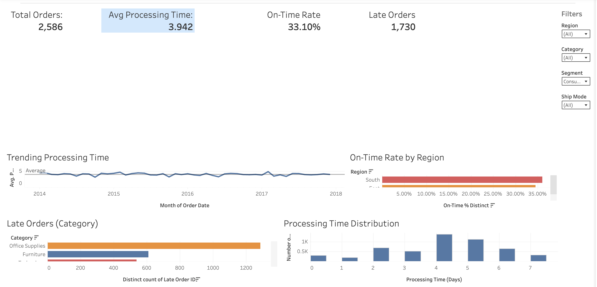
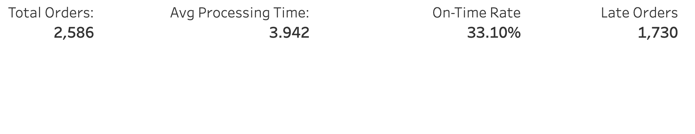
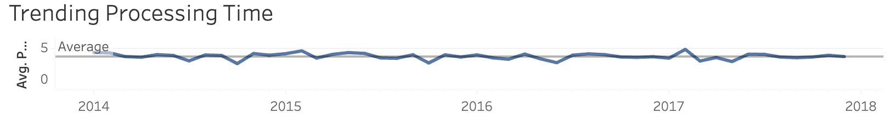
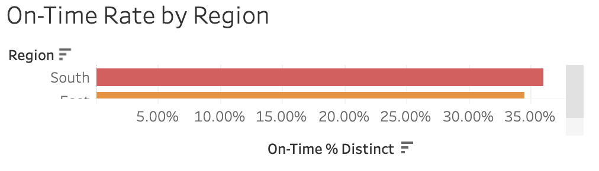
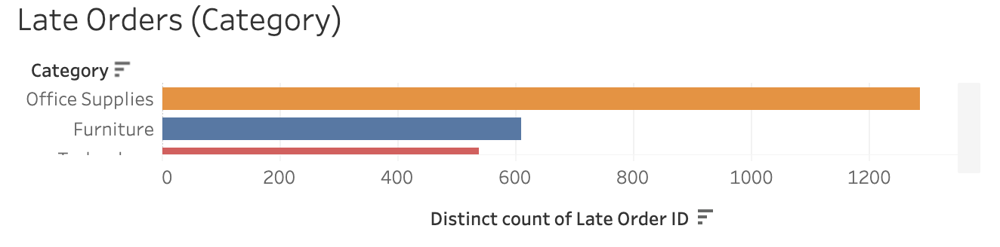
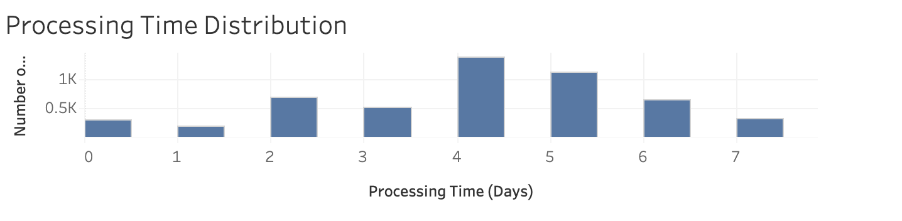

# Operations Performance Dashboard

## Overview

This project presents an operations performance dashboard built in Tableau to monitor order fulfillment efficiency through key operational metrics including order volume, processing time, on-time delivery rate, and late orders. The dashboard provides business stakeholders with a high-level view of operational performance while highlighting trends and areas requiring attention.

The dashboard is designed as an executive-level operations monitoring tool that enables users to quickly assess operational health, identify performance trends, and detect areas requiring process improvement.

## Dashboard Preview

---

## Use Case

This dashboard is designed for:

- Operations managers monitoring order fulfillment performance
- Business analysts evaluating operational efficiency
- Leadership teams tracking service levels and delivery performance

---

## Business Questions

This dashboard is built to answer the following questions:

- How many customer orders are being processed?
- Is processing time improving or declining over time?
- Are customer orders being delivered on time?
- Which regions maintain the highest on-time delivery performance?
- Which product categories experience the most late orders?
- How is processing time distributed across all customer orders?

---

## Dashboard Metrics

The dashboard includes the following key performance indicators (KPIs):

- Total Orders
- Average Processing Time
- On-Time Delivery Rate
- Late Orders

These KPIs provide an executive summary of operational performance.

---

## Dashboard Walkthrough

### KPI Summary

Provides an executive snapshot of overall operational performance by displaying total order volume, average processing time, on-time delivery rate, and total late orders.

---

### Processing Time Trend

Tracks average processing time over time to monitor operational efficiency and identify trends in fulfillment performance.

---

### On-Time Delivery Rate by Region

Compares on-time delivery performance across the North, South, East, and West regions to identify geographic differences in service levels.

---

### Late Orders by Category

Displays the number of late orders across Office Supplies, Furniture, and Technology to identify product categories that may require operational improvements.

---

### Processing Time Distribution

Visualizes the distribution of processing times using bins, helping identify typical fulfillment times as well as unusually long processing periods.

---

## Key Insights

This dashboard enables users to:

- Monitor operational performance through executive-level KPIs
- Track changes in processing efficiency over time
- Compare service performance across geographic regions
- Identify product categories with elevated late-order volume
- Understand the distribution of processing times to detect operational bottlenecks

---

## Dataset

The dashboard is built using customer order data containing:

- Order Date
- Region
- Category
- Segment
- Processing Time (Days)
- Delivery Status
- On-Time Indicator

### Data Assumptions

- Each record represents one customer order.
- Processing time is measured in days.
- An order is considered on time if it is delivered by its promised delivery date.
- Categories include Office Supplies, Furniture, and Technology.
- Customer segments include Consumer, Corporate, and Home Office.
- Regions include North, South, East, and West.
- The dataset is intended for analytical demonstration purposes.

---

## Tools Used

- Tableau Desktop
- Tableau Public
- Microsoft Excel (data preparation)
- GitHub

---

## Future Improvements

Potential enhancements include:

- Interactive filtering by customer segment
- Drill-down analysis by product subcategory
- Regional performance benchmarking
- SLA compliance tracking
- Integration with live operational data sources

---

## View the Dashboard

**Tableau Public:**  
[Operations Performance Dashboard](INSERT_TABLEAU_PUBLIC_LINK_HERE)
