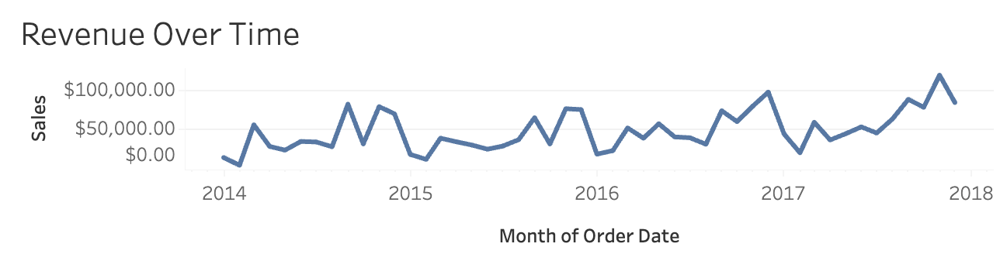
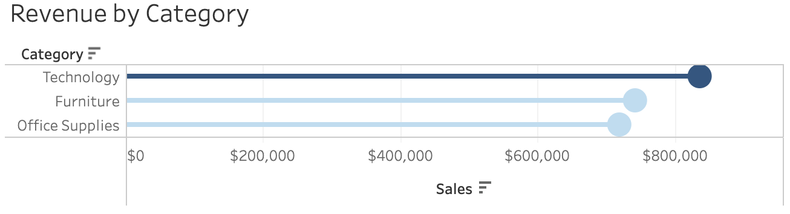
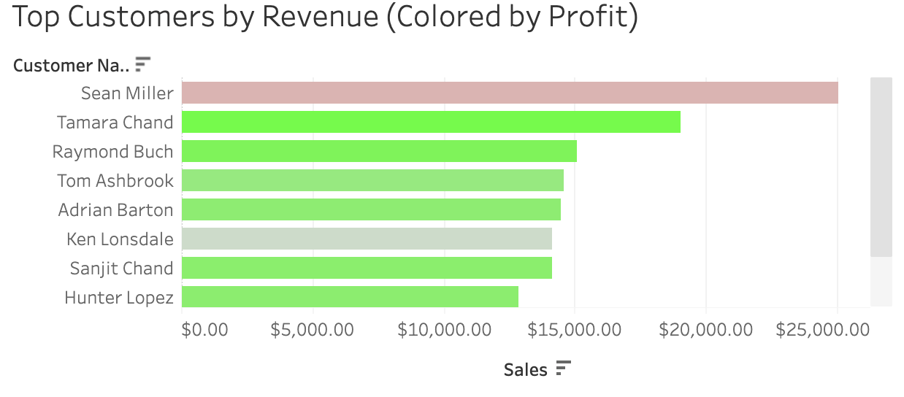

# Sales Performance Dashboard

## Overview

This project presents an executive sales performance dashboard built in Tableau to monitor revenue, profit, and order volume across customer segments, product categories, and individual customers. The dashboard provides a high-level view of business performance while highlighting sales trends, customer profitability, and the relationship between revenue and profit.

The goal of this dashboard is to move beyond simple sales reporting by identifying customers and product categories that drive profitable business growth.

---

## Dashboard Preview

---

## Use Case

This dashboard is designed for:

- Sales managers monitoring overall business performance
- Business analysts evaluating sales trends
- Leadership teams reviewing revenue and profitability
- Regional and account managers identifying high-value customers

---

## Business Questions

This dashboard is built to answer the following questions:

- How is revenue trending over time?
- Which product categories generate the highest revenue?
- Which customers generate the most revenue?
- Are top revenue customers also the most profitable?
- What is the relationship between sales and profit across customer segments?

---

## Dashboard Metrics

The dashboard includes the following executive KPIs:

- Total Revenue
- Total Profit
- Total Orders

These KPIs provide a high-level summary of overall sales performance.

---

## Dashboard Walkthrough

### KPI Summary

Provides an executive snapshot of overall sales performance by displaying total revenue, total profit, and total order volume.

---

### Revenue Trend Over Time

Tracks revenue over time to identify growth patterns and changes in overall sales performance.

---

### Revenue by Category

Compares revenue across Furniture, Office Supplies, and Technology using a lollipop chart to quickly identify the strongest-performing product categories.

---

### Top Revenue Customers (Colored by Profit)

Ranks the highest revenue-generating customers while coloring each customer by profit. This visualization demonstrates that high revenue does not always translate into high profitability.

---

### Sales vs. Profit by Customer Segment

Displays the relationship between sales and profit for individual customer orders. The scatter plot highlights the overall positive relationship between revenue and profit while exposing high-revenue outliers that generate negative profit.

---

## Key Insights

This dashboard enables users to:

- Monitor executive sales KPIs at a glance.
- Track revenue trends over time.
- Compare product category performance.
- Identify the highest revenue-generating customers.
- Detect customers generating high revenue but low or negative profit.
- Analyze the relationship between sales and profit across customer segments.

One notable finding from this analysis is that the highest revenue-generating customer produced a negative profit, illustrating that customer value should be evaluated using both revenue and profitability rather than revenue alone.

---

## Dataset

The dashboard is built using transactional sales order data containing:

- Order ID
- Customer Name
- Order Date
- Sales
- Profit
- Product Category
- Customer Segment
- Region

### Data Assumptions

- Each record represents one customer order.
- Revenue and profit are measured at the order level.
- Customer segments include Consumer, Corporate, and Home Office.
- Product categories include Furniture, Office Supplies, and Technology.
- Regions include North, South, East, and West.
- The dataset is intended for analytical demonstration purposes.

---

## Tools Used

- Tableau Desktop
- Tableau Public
- Microsoft Excel (data preparation)
- GitHub

---

## Future Improvements

Potential enhancements include:

- Interactive regional filtering
- Product-level drill-down analysis
- Customer lifetime value analysis
- Sales forecasting
- Integration with a live data source

---

## View the Dashboard

**Tableau Public:**  
[Sales Performance Dashboard](INSERT_TABLEAU_PUBLIC_LINK_HERE)
